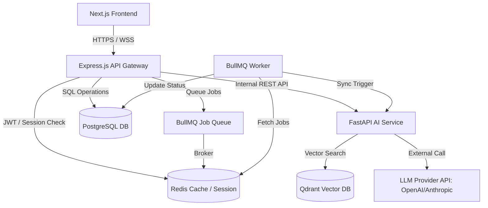
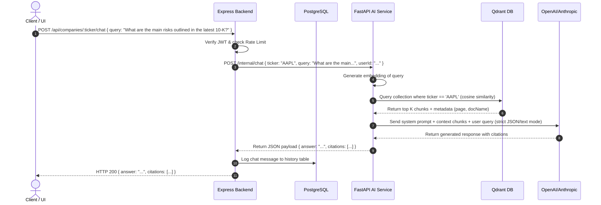
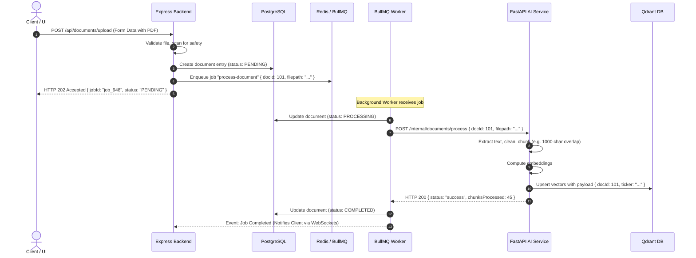

# System Architecture: AlphaLens AI

This document provides a detailed overview of the system architecture, component integrations, data flows, and design patterns utilized in **AlphaLens AI**.

---

## 1. System Topology Overview

AlphaLens AI uses a microservices topology to separate the client-facing API gateway and business logic from CPU-bound AI processing, vectorization, and LLM operations.



### Core Architecture Components:
1. **Next.js Frontend**: Hosted independently. Serves as the web interface, utilizing React Server Components (RSC) for performance and dynamic client charts.
2. **Node.js Express Gateway**: Serves as the primary public API. It handles:
   - Request routing and validation.
   - User authentication and authorization (RBAC).
   - CRUD operations on relational metadata (Portfolios, watchlists, billing, logs).
   - Enqueueing heavy background processes into Redis via BullMQ.
3. **Python FastAPI Service**: Internal microservice isolated from the public internet. Serves endpoints exclusively to the Node.js API Gateway. It orchestrates:
   - Chunking and embedding generation.
   - Qdrant similarity searches.
   - Structured JSON response parsing using Pydantic.
   - Financial statement processing.
4. **Qdrant**: High-performance vector database storing document chunks and dense embeddings representing SEC filings, transcripts, and reports.
5. **PostgreSQL**: System of record for structured data (Users, Auth tokens, Portfolios, news metadata, document processing state).
6. **Redis**: Cache repository and message broker for BullMQ background workers.

---

## 2. Core Execution Flows

### 2.1 RAG Company Chat Sequence

This sequence describes how a user queries information about a stock and receives an answers backed by SEC filing citations.



### 2.2 Document Processing & Vectorization

This diagram displays the asynchronous flow of document uploads.



---

## 3. Node.js Backend Design Patterns

The Express backend implements the **Repository Pattern** and **Service Layer** separation to maintain clean boundary scopes:

* **Routes Layer**: Standard Express Router mappings. Responsible for binding middleware (auth, rate limits, validation) and passing clean payloads to the Controller.
* **Controller Layer**: Decoupled handlers. They translate HTTP concerns (status codes, request query parsing) into service method invocations.
* **Service Layer**: House business rules. Contains logic for portfolio optimization formulas, calling the FastAPI server, or dispatching jobs to BullMQ.
* **Repository Layer**: Encapsulates all direct database queries using the Prisma Client. Keeps model queries isolated so that shifting to a different database or raw SQL queries doesn't bleed into business logic.

---

## 4. Database Schema Structure

```mermaid
erDiagram
    USER ||--|| PROFILE : has
    USER ||--o{ PORTFOLIO : owns
    USER ||--o{ WATCHLIST : tracks
    PORTFOLIO ||--o{ TRANSACTION : contains
    COMPANY ||--o{ WATCHLIST : tracked_in
    COMPANY ||--o{ DOCUMENT : has
    COMPANY ||--o{ NEWS : references

    USER {
        string id PK
        string email UNIQUE
        string passwordHash
        string role
        datetime createdAt
    }
    PROFILE {
        string id PK
        string userId FK
        string fullName
        string preferredSectors
        string riskTolerance
    }
    PORTFOLIO {
        string id PK
        string userId FK
        string name
        datetime createdAt
    }
    TRANSACTION {
        string id PK
        string portfolioId FK
        string ticker
        int quantity
        float purchasePrice
        datetime transactionDate
    }
    COMPANY {
        string ticker PK
        string name
        string sector
        string industry
        json financials
        datetime lastSynced
    }
    DOCUMENT {
        string id PK
        string companyTicker FK
        string filename
        string status
        int size
        string qdrantCollection
        datetime createdAt
    }
    NEWS {
        string id PK
        string title
        string url
        string summary
        float sentimentScore
        string companyTicker FK
        datetime publishedAt
    }
```
